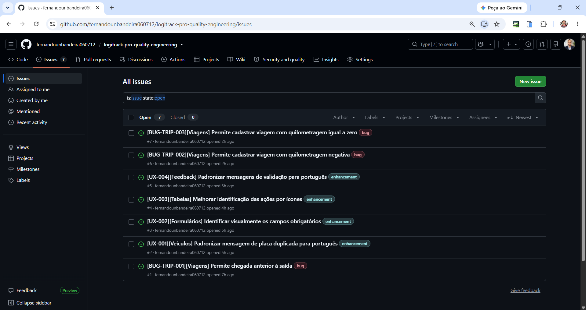
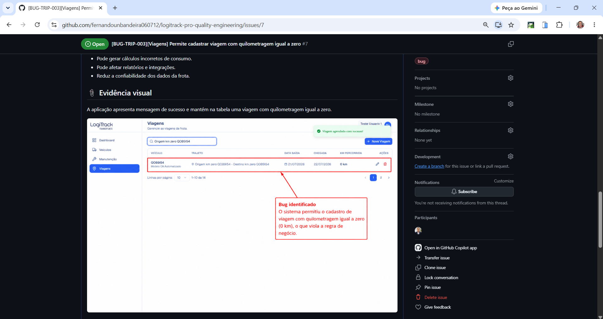
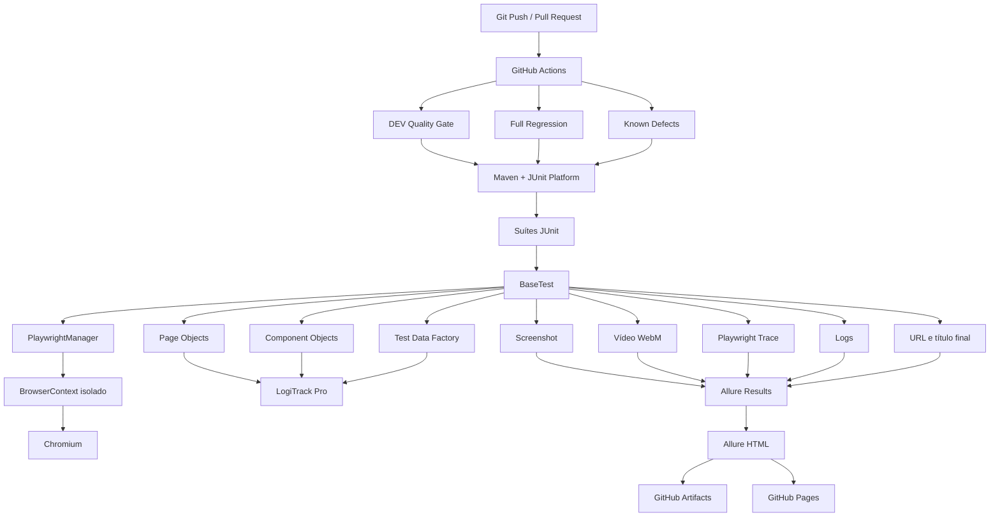
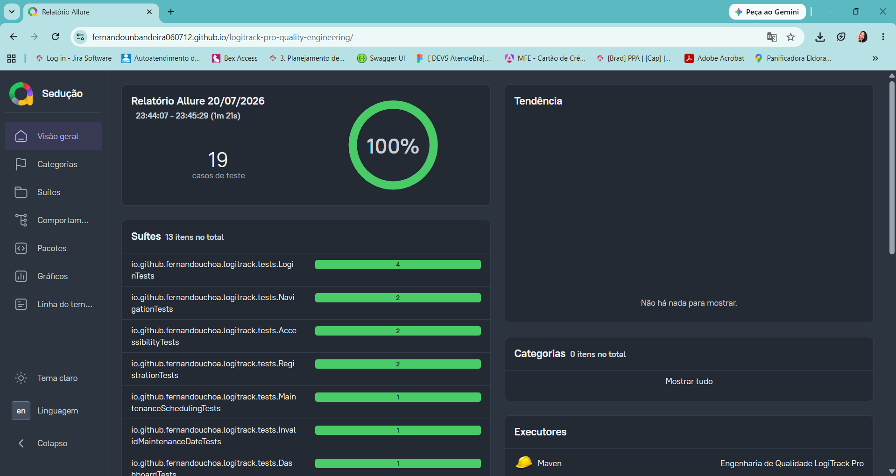
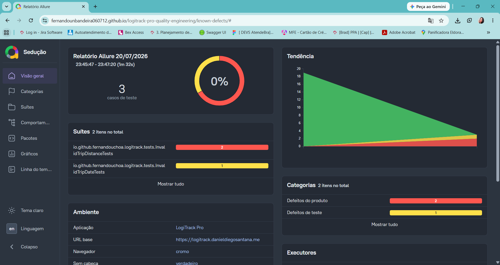
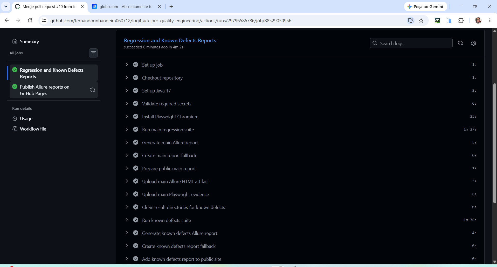
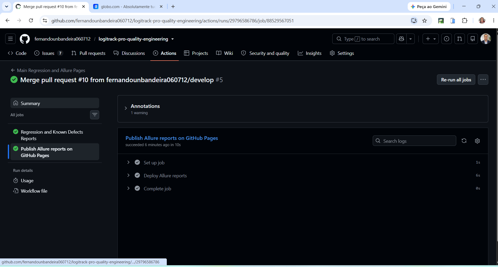
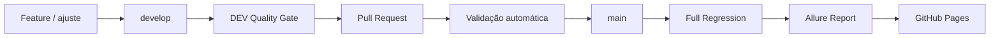

<div align="center">

# 🚚 LogiTrack Pro — Quality Engineering

### Estratégia de qualidade, automação de testes e CI/CD aplicadas a um sistema de gestão de frotas

**Projeto desenvolvido com mentalidade de Engenharia de Qualidade: da análise de risco à publicação pública das evidências.**

<br>

[](https://github.com/fernandounbandeira060712/logitrack-pro-quality-engineering/actions/workflows/dev-quality-gate.yml)
[](https://github.com/fernandounbandeira060712/logitrack-pro-quality-engineering/actions/workflows/main-regression-allure-pages.yml)
[](https://github.com/fernandounbandeira060712/logitrack-pro-quality-engineering/issues)

<br>


<br>

## 📊 [ACESSAR O RELATÓRIO ALLURE PÚBLICO](https://fernandounbandeira060712.github.io/logitrack-pro-quality-engineering/)

**Screenshot • Vídeo • Playwright Trace • Logs • URL final • Resultado das suítes**

</div>
<!-- E2E-DEMO-TOP:START -->
<div align="center">
  <h2>&#127916; Demonstra&ccedil;&atilde;o E2E</h2>

  <p>
    <strong>Execu&ccedil;&atilde;o automatizada real do fluxo completo do LogiTrack Pro.</strong>
  </p>

  <a href="docs/media/logitrack-e2e-demo.webm">
    
  </a>

  <p>
    <a href="docs/media/logitrack-e2e-demo.webm">
      &#9654; Assistir ao v&iacute;deo completo em melhor qualidade
    </a>
  </p>
</div>

<details>
<summary><strong>Como executar a demonstra&ccedil;&atilde;o localmente</strong></summary>

```powershell
$env:LOGITRACK_SLOW_MO = "350"

powershell -ExecutionPolicy Bypass `
  -File .\executar-testes-com-allure.ps1 `
  -Email "SEU_EMAIL" `
  -Password "SUA_SENHA" `
  -Test "FleetManagementE2ETests" `
  -RetryCount 0

Remove-Item Env:LOGITRACK_SLOW_MO -ErrorAction SilentlyContinue
```

</details>
<!-- E2E-DEMO-TOP:END -->
---

## 📚 Índice

- [Visão executiva](#-visão-executiva)
- [O que o projeto demonstra](#-o-que-o-projeto-demonstra)
- [Escopo de qualidade](#-escopo-de-qualidade)
- [Resultados e achados](#-resultados-e-achados)
- [Arquitetura](#️-arquitetura)
- [Estrutura do repositório](#-estrutura-do-repositório)
- [Suítes de execução](#-suítes-de-execução)
- [Evidências e Allure](#-evidências-e-allure)
- [CI/CD e Git Flow](#️-cicd-e-git-flow)
- [Como executar](#-como-executar)
- [Documentação](#-documentação)
- [Competências demonstradas](#-competências-demonstradas)
- [Roadmap](#️-roadmap)
- [Autor](#-autor)

---

# 🎯 Visão executiva

O **LogiTrack Pro Quality Engineering** é um projeto completo de avaliação da qualidade de uma aplicação web de gestão de frotas.

O trabalho vai além da criação de scripts automatizados. Ele reúne:

- planejamento e estratégia de testes;
- análise de riscos;
- levantamento de regras de negócio;
- cenários funcionais, negativos, de limite e E2E;
- automação de interface com Playwright;
- validações de acessibilidade básica;
- geração automática de evidências;
- rastreabilidade entre requisitos, testes, defeitos e melhorias;
- registro de bugs e oportunidades de UX em GitHub Issues;
- execução paralela e retry controlado;
- pipelines separadas por objetivo;
- publicação pública do Allure Report pelo GitHub Pages.

O objetivo é demonstrar como a Qualidade pode ser tratada como uma disciplina de Engenharia, conectando **produto, negócio, automação, observabilidade e entrega contínua**.

---

# 🚀 O que o projeto demonstra

| Área | Implementação |
|---|---|
| Estratégia de QA | Plano de testes, riscos, prioridades e critérios de saída |
| Automação UI | Playwright com Java 17 e JUnit 5 |
| Arquitetura | Page Objects, Component Objects, configuração, fábrica de dados e utilitários |
| Testes de negócio | Datas, unicidade de placa, valores financeiros e quilometragem |
| Testes E2E | Fluxo integrado entre veículo, manutenção e viagem |
| Testes negativos | Credenciais, campos obrigatórios, datas e valores inválidos |
| Limites | Senha mínima, custo negativo e quilometragem zero |
| Acessibilidade | Texto alternativo e nomes acessíveis em botões |
| Evidências | Screenshot, vídeo, trace, logs e informações da página |
| Gestão de defeitos | Bugs reproduzíveis, impacto, severidade e evidência visual |
| UX | Melhorias de idioma, feedback, campos obrigatórios e ações por ícones |
| CI/CD | GitHub Actions para DEV, regressão e defeitos conhecidos |
| Relatório público | Allure publicado automaticamente no GitHub Pages |
| Segurança de credenciais | Dados sensíveis fornecidos por parâmetros e GitHub Secrets |

---

# 🔎 Escopo de qualidade

## Autenticação e cadastro

- login com credenciais válidas;
- rejeição de credenciais inválidas;
- validação de campos obrigatórios;
- validação do formato de e-mail;
- acesso ao formulário de cadastro;
- validação do tamanho mínimo de senha.

## Dashboard e navegação

- carregamento da área autenticada;
- validação das rotas principais;
- navegação entre Dashboard, Veículos, Manutenções e Viagens;
- mapeamento dos elementos da aplicação.

## Veículos

- cadastro com dados válidos;
- geração de placas únicas no padrão Mercosul;
- validação de mensagem de sucesso;
- confirmação do registro na tabela;
- bloqueio de placa duplicada.

## Manutenções

- agendamento válido;
- vínculo da manutenção ao veículo;
- validação de mensagem e persistência;
- bloqueio de data final anterior à inicial;
- bloqueio de custo estimado negativo;
- validação do feedback apresentado ao usuário.

## Viagens

- cadastro válido;
- vínculo da viagem ao veículo;
- validação de rota, datas e quilometragem;
- validação de chegada anterior à saída;
- validação de quilometragem negativa;
- validação de quilometragem igual a zero.

## Acessibilidade básica

- imagens com alternativa textual;
- botões com nome acessível;
- análise de melhorias para campos obrigatórios e ações por ícones.

## Fluxo E2E

A suíte executa um fluxo integrado:

```text
Login
  → cadastro de veículo
  → validação do veículo
  → agendamento de manutenção
  → validação da manutenção
  → cadastro de viagem
  → validação da viagem
```

---

# 🐞 Resultados e achados

O projeto não considera um teste reprovado apenas como um número vermelho. Cada comportamento inesperado é investigado, documentado e associado a uma evidência reproduzível.

## Defeitos confirmados

| ID | Defeito | Issue |
|---|---|---|
| BUG-TRIP-001 | Permite cadastrar viagem com chegada anterior à saída | [#1](https://github.com/fernandounbandeira060712/logitrack-pro-quality-engineering/issues/1) |
| BUG-TRIP-002 | Permite cadastrar viagem com quilometragem negativa | [#6](https://github.com/fernandounbandeira060712/logitrack-pro-quality-engineering/issues/6) |
| BUG-TRIP-003 | Permite cadastrar viagem com quilometragem igual a zero | [#7](https://github.com/fernandounbandeira060712/logitrack-pro-quality-engineering/issues/7) |

## Oportunidades de melhoria

| ID | Melhoria | Issue |
|---|---|---|
| UX-001 | Padronizar mensagem de placa duplicada para português | [#2](https://github.com/fernandounbandeira060712/logitrack-pro-quality-engineering/issues/2) |
| UX-002 | Identificar visualmente os campos obrigatórios | [#3](https://github.com/fernandounbandeira060712/logitrack-pro-quality-engineering/issues/3) |
| UX-003 | Melhorar a identificação das ações por ícones | [#4](https://github.com/fernandounbandeira060712/logitrack-pro-quality-engineering/issues/4) |
| UX-004 | Padronizar mensagens de validação para português | [#5](https://github.com/fernandounbandeira060712/logitrack-pro-quality-engineering/issues/5) |


## Gestão visual dos achados

As ocorrências identificadas foram registradas no próprio repositório, com classificação por tipo, descrição do impacto, resultado esperado, resultado obtido e evidência visual.

### Visão consolidada das Issues



A lista evidencia a separação entre:

- **3 defeitos funcionais**, identificados com a label `bug`;
- **4 oportunidades de melhoria**, identificadas com a label `enhancement`.

### Exemplo de defeito documentado com evidência



O exemplo acima demonstra a rastreabilidade entre:

```text
regra de negócio
→ cenário automatizado
→ falha reproduzida
→ evidência visual
→ GitHub Issue
```


> Os defeitos conhecidos permanecem automatizados e reproduzíveis, mas são isolados da regressão principal por meio da tag `known-defect`.

---

# 🏗️ Arquitetura



## Princípios aplicados

- separação de responsabilidades;
- baixo acoplamento entre testes e interface;
- componentes reutilizáveis;
- massa de dados centralizada;
- isolamento de navegador por teste;
- execução paralela por classe;
- coleta de evidências independente do resultado;
- testes de defeitos conhecidos separados da regressão;
- credenciais externas ao código-fonte.

---

# 📂 Estrutura do repositório

```text
logitrack-pro-quality-engineering
├── .github
│   └── workflows
│       ├── dev-quality-gate.yml
│       ├── main-regression-allure-pages.yml
│       └── known-defects.yml
│
├── docs
│   ├── defects
│   ├── evidencias
│   ├── 01-plano-e-estrategia-de-testes.md
│   ├── 02-cenarios-de-teste.md
│   ├── 03-analise-de-ux.md
│   ├── 04-estrategia-de-testes-adicionais.md
│   └── 05-matriz-de-rastreabilidade.md
│
├── evidence
│   ├── defects
│   └── ux
│
├── performance
│
├── src
│   ├── main
│   │   ├── java/io/github/fernandouchoa/logitrack
│   │   │   ├── components
│   │   │   ├── config
│   │   │   ├── core
│   │   │   ├── data
│   │   │   ├── models
│   │   │   ├── pages
│   │   │   └── utils
│   │   └── resources
│   │
│   └── test
│       ├── java/io/github/fernandouchoa/logitrack
│       │   ├── base
│       │   ├── e2e
│       │   ├── extensions
│       │   ├── suites
│       │   ├── tests
│       │   └── utils
│       └── resources
│
├── executar-testes-com-allure.ps1
└── pom.xml
```

---

# 🧪 Suítes de execução

## DEV Quality Gate

Executa os principais fluxos em pushes para `develop` e em Pull Requests.

Inclui:

- login;
- dashboard;
- cadastro de veículo;
- manutenção;
- viagem;
- fluxo E2E completo.

```text
DevQualityGateSuite
```

## Full Regression

Executa a cobertura funcional principal na branch `main`, excluindo defeitos conhecidos.

Inclui:

- autenticação;
- cadastro;
- acessibilidade;
- navegação;
- mapeamento;
- veículos;
- manutenções;
- viagens;
- regras de negócio;
- E2E.

```text
FullRegressionSuite
```

## Known Defects

Executa manualmente os cenários associados aos defeitos confirmados.

```text
KnownDefectsSuite
```

Essa separação permite:

- manter a regressão principal confiável;
- reproduzir falhas conhecidas sob demanda;
- preservar a evidência técnica;
- confirmar rapidamente uma futura correção.

---

# 📊 Evidências e Allure

## Relatórios públicos segregados

A estratégia de publicação separa os resultados que representam a saúde atual da aplicação dos cenários que reproduzem defeitos já conhecidos.

| Relatório | Suíte | Resultado da execução registrada | Função no processo |
|---|---|---:|---|
| [Regressão principal](https://fernandounbandeira060712.github.io/logitrack-pro-quality-engineering/) | `FullRegressionSuite` | **19 aprovados — 100%** | Atua como Quality Gate e deve permanecer verde |
| [Defeitos conhecidos](https://fernandounbandeira060712.github.io/logitrack-pro-quality-engineering/known-defects/) | `KnownDefectsSuite` | **3 cenários reproduzidos — 0%** | Mantém os bugs reproduzíveis sem bloquear a entrega |

### Por que os relatórios são separados?

- **Sinal confiável:** a regressão principal mostra somente a qualidade dos fluxos que precisam estar funcionando.
- **Rastreabilidade:** os defeitos confirmados continuam automatizados, documentados e acompanhados por evidências.
- **Entrega segura:** falhas antigas e já conhecidas não escondem uma nova regressão nem bloqueiam alterações sem relação com elas.
- **Detecção de correção:** quando um bug for resolvido, o cenário correspondente mudará de status e indicará que a Issue pode ser reavaliada.
- **Leitura executiva:** recrutadores, QAs, desenvolvedores e gestores conseguem distinguir rapidamente regressão de produto e dívida de qualidade conhecida.

### Regressão principal — 19 cenários aprovados



A página principal apresenta a suíte funcional utilizada como Quality Gate. Nesta execução, os **19 casos foram aprovados**, sem falhas, erros ou cenários ignorados.

### Defeitos conhecidos — execução isolada



O relatório isolado mantém três comportamentos problemáticos sob observação. Na execução registrada:

- **2 cenários vermelhos:** falhas funcionais classificadas como defeitos do produto;
- **1 cenário amarelo:** ocorrência classificada como defeito de teste ou problema técnico;
- **0% de aprovação:** resultado esperado enquanto os comportamentos documentados permanecerem sem correção.

> Um relatório vermelho de defeitos conhecidos não significa que o Quality Gate principal falhou. Ele comprova que os bugs continuam reproduzíveis e visíveis.

### Como consultar as evidências públicas

No relatório desejado, siga este caminho:

```text
Suítes → selecione a classe de teste → selecione o cenário → Corpo de teste
```

Cada cenário pode disponibilizar:

- screenshot final;
- vídeo WebM;
- Playwright Trace;
- logs;
- URL e título da página;
- resultado Maven/JUnit.
## Evidências coletadas

Cada execução automatizada pode disponibilizar:

| Evidência | Finalidade |
|---|---|
| Screenshot final | Estado visual da aplicação após o cenário |
| Vídeo WebM | Reprodução completa da interação |
| Playwright Trace | Inspeção passo a passo, DOM, ações e rede |
| Logs | Eventos do navegador e informações técnicas |
| URL e título final | Contexto da página no encerramento |
| Surefire Reports | Resultado técnico da execução Maven/JUnit |
| Allure Results | Dados estruturados para o relatório |
| Allure HTML | Dashboard navegável e compartilhável |

## Diretórios locais

```text
target/allure-results
target/site/allure-maven-plugin
target/screenshots
target/videos
target/traces
target/logs
target/surefire-reports
```

---

# ⚙️ CI/CD e Git Flow

## Pipelines

| Workflow | Gatilho | Objetivo |
|---|---|---|
| DEV Quality Gate | Push em `develop`, PR para `main` ou `develop`, execução manual | Feedback rápido dos fluxos críticos |
| Main Regression and Allure Pages | Push em `main` ou execução manual | Regressão completa e publicação do Allure |
| Known Defects Reproduction | Execução manual | Reprodução controlada dos defeitos documentados |


## Pipeline em execução

O workflow da branch `main` produz os dois relatórios em uma única execução controlada:

```text
FullRegressionSuite
        ↓
Allure principal
        ↓
public-site/

KnownDefectsSuite
        ↓
Allure de defeitos conhecidos
        ↓
public-site/known-defects/

public-site
        ↓
GitHub Pages
```

A execução da suíte de defeitos conhecidos captura o resultado para gerar o relatório, mas não transforma uma falha funcional já documentada em falha do Quality Gate principal.

### Regressão e defeitos conhecidos no mesmo workflow



A evidência acima demonstra:

- regressão principal concluída;
- relatório principal gerado;
- resultados anteriores limpos antes da segunda suíte;
- defeitos conhecidos executados separadamente;
- segundo Allure gerado e incluído em `/known-defects/`;
- artefatos e evidências preservados por objetivo.

### Publicação dos dois relatórios no GitHub Pages



O job de deploy publica um único artefato `public-site`, contendo:

```text
/
├── index.html
├── reports.html
└── known-defects/
    └── index.html
```

Links públicos:

- [Regressão principal](https://fernandounbandeira060712.github.io/logitrack-pro-quality-engineering/)
- [Defeitos conhecidos](https://fernandounbandeira060712.github.io/logitrack-pro-quality-engineering/known-defects/)
## Fluxo de desenvolvimento



## Credenciais na pipeline

As credenciais não são armazenadas no código.

Os workflows utilizam:

```text
LOGITRACK_EMAIL
LOGITRACK_PASSWORD
```

Esses valores são cadastrados em:

```text
Settings → Secrets and variables → Actions
```

---

# ⚡ Como executar

## Pré-requisitos

- Java 17;
- Maven;
- Git;
- PowerShell para utilizar o executor automatizado no Windows;
- acesso válido à aplicação de testes.

## Clonar o repositório

```bash
git clone https://github.com/fernandounbandeira060712/logitrack-pro-quality-engineering.git
cd logitrack-pro-quality-engineering
```

Para trabalhar no fluxo de desenvolvimento:

```bash
git switch develop
```

## Instalar o Chromium do Playwright

### PowerShell

```powershell
mvn exec:java `
  "-Dexec.mainClass=com.microsoft.playwright.CLI" `
  "-Dexec.args=install chromium"
```

### Bash

```bash
mvn exec:java \
  -Dexec.mainClass=com.microsoft.playwright.CLI \
  -Dexec.args="install chromium"
```

## Compilar sem executar os testes

```powershell
mvn clean test "-DskipTests"
```

## Execução recomendada no Windows

O projeto possui um executor que configura a execução, gera evidências e abre o Allure localmente:

```powershell
powershell -ExecutionPolicy Bypass `
  -File .\executar-testes-com-allure.ps1 `
  -Email "SEU_EMAIL" `
  -Password "SUA_SENHA" `
  -Headless
```

## Executar a suíte DEV

```powershell
mvn clean test `
  "-Dtest=DevQualityGateSuite" `
  "-Demail=SEU_EMAIL" `
  "-Dpassword=SUA_SENHA" `
  "-Dheadless=true" `
  "-DopenAllure=false" `
  "-Dtest.retry.count=1"
```

## Executar a regressão completa

```powershell
mvn clean test `
  "-Dtest=FullRegressionSuite" `
  "-Demail=SEU_EMAIL" `
  "-Dpassword=SUA_SENHA" `
  "-Dheadless=true" `
  "-DopenAllure=false" `
  "-Dtest.retry.count=1"
```

## Reproduzir defeitos conhecidos

> Essa suíte é criada para reproduzir falhas confirmadas e pode apresentar testes reprovados enquanto os bugs estiverem abertos.

```powershell
mvn clean test `
  "-Dtest=KnownDefectsSuite" `
  "-DrunKnownDefects=true" `
  "-Demail=SEU_EMAIL" `
  "-Dpassword=SUA_SENHA" `
  "-Dheadless=true" `
  "-DopenAllure=false" `
  "-Dtest.retry.count=0"
```

Pelo executor PowerShell:

```powershell
powershell -ExecutionPolicy Bypass `
  -File .\executar-testes-com-allure.ps1 `
  -Email "SEU_EMAIL" `
  -Password "SUA_SENHA" `
  -RunKnownDefects `
  -RetryCount 0
```

## Executar uma classe específica

```powershell
mvn clean test `
  "-Dtest=VehicleRegistrationTests" `
  "-Demail=SEU_EMAIL" `
  "-Dpassword=SUA_SENHA" `
  "-Dheadless=false"
```

## Gerar o Allure local

```powershell
mvn allure:report
```

Com o Allure CLI instalado:

```powershell
allure serve target/allure-results
```

---

# 📝 Documentação

| Documento | Conteúdo |
|---|---|
| [Plano e estratégia de testes](docs/01-plano-e-estrategia-de-testes.md) | Objetivo, escopo, riscos e abordagem |
| [Cenários de teste](docs/02-cenarios-de-teste.md) | Casos executados, resultados e evidências |
| [Análise de UX](docs/03-analise-de-ux.md) | Oportunidades de melhoria da experiência |
| [Estratégia de testes adicionais](docs/04-estrategia-de-testes-adicionais.md) | API, performance, segurança e outras camadas |
| [Matriz de rastreabilidade](docs/05-matriz-de-rastreabilidade.md) | Relação entre requisitos e artefatos |
| [Defeitos](docs/defects/) | Relatórios detalhados dos bugs |
| [Evidências](evidence/) | Imagens de defeitos e melhorias |

---

# 🏆 Competências demonstradas

Este projeto evidencia competências relevantes para posições de **QA Engineer**, **QA Automation Engineer**, **SDET** e **Quality Engineer**:

- desenho de estratégia de testes baseada em risco;
- leitura exploratória de uma aplicação sem documentação técnica completa;
- identificação e formalização de regras de negócio;
- escrita de cenários funcionais, negativos e de limite;
- automação de UI com Playwright e Java;
- organização com Page Object e Component Object;
- construção de massas de dados reutilizáveis;
- execução paralela com isolamento;
- retry controlado para instabilidade de ambiente;
- criação de suíte E2E;
- captura automática de evidências;
- análise de acessibilidade básica;
- documentação de defeitos com impacto e critérios de aceite;
- análise de experiência do usuário;
- rastreabilidade de qualidade;
- Git Flow com `develop` e `main`;
- pipelines segmentadas;
- proteção de credenciais com GitHub Secrets;
- publicação automática de relatório no GitHub Pages.

## O diferencial

Um framework tradicional pode executar testes.

Este projeto também:

- explica **por que** cada cenário existe;
- relaciona o teste ao risco do produto;
- separa defeitos conhecidos da regressão;
- mantém os bugs reproduzíveis;
- transforma execução em evidência auditável;
- publica os resultados para qualquer avaliador;
- conecta testes, documentação, Issues e CI/CD.

---

# 🗺️ Roadmap

## Implementado

- [x] Java 17;
- [x] Playwright;
- [x] JUnit 5;
- [x] Maven;
- [x] Page Object Model;
- [x] Component Object Model;
- [x] configuração centralizada;
- [x] fábrica de dados;
- [x] execução paralela com três workers;
- [x] retry configurável;
- [x] screenshot;
- [x] vídeo;
- [x] Playwright Trace;
- [x] logs;
- [x] Allure Report;
- [x] GitHub Actions;
- [x] DEV Quality Gate;
- [x] Full Regression;
- [x] Known Defects Suite;
- [x] publicação do Allure no GitHub Pages;
- [x] documentação de QA;
- [x] GitHub Issues para bugs e melhorias;
- [x] fluxo E2E integrado;
- [x] testes de acessibilidade básica.

## Próximas evoluções

- [ ] automação de API;
- [ ] testes de contrato;
- [ ] matriz cross-browser;
- [ ] testes de performance executáveis;
- [ ] integração com CodeQL;
- [ ] análise de dependências;
- [ ] JaCoCo;
- [ ] SonarCloud;
- [ ] Docker;
- [ ] notificações em Teams ou Slack;
- [ ] histórico persistente do Allure entre execuções.

---

# 🤝 Contribuindo

Contribuições, sugestões e revisões são bem-vindas.

Fluxo recomendado:

```text
feature branch
  → develop
  → DEV Quality Gate
  → Pull Request
  → main
  → Full Regression
  → Allure público
```

---

# 👨‍💻 Autor

**Fernando Uchôa**

QA Engineer com foco em automação de testes, Engenharia de Qualidade, Java, Playwright, Selenium, testes de API e CI/CD.

[](https://www.linkedin.com/in/fernando-uchoa/)
[](https://github.com/fernandounbandeira060712)

---

<div align="center">

### Qualidade não é apenas encontrar defeitos.

### É criar confiança para que o produto possa evoluir com segurança.

</div>

<!-- DEMO-E2E:START -->
